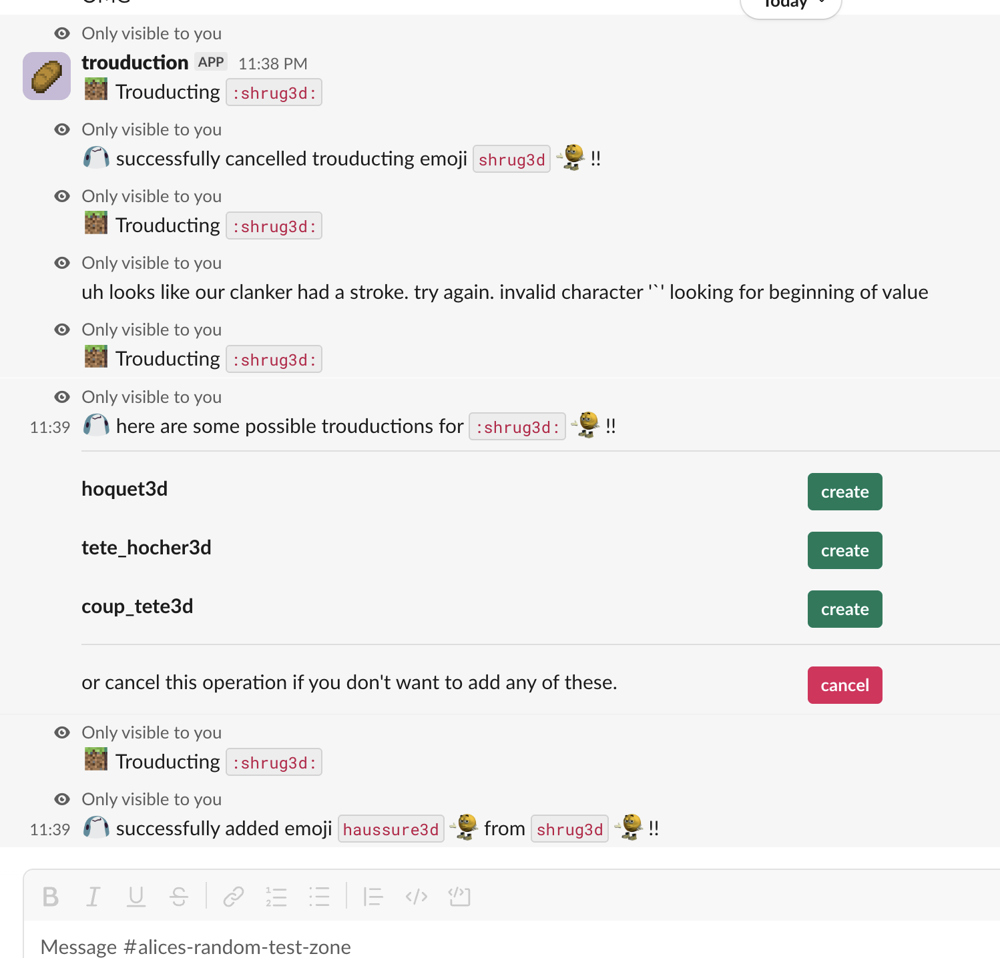

# trouduction

this is a simple slackbot that started from a joke right at the time when I needed a small side project. \
basically, this small slackbots takes an emoji as the only input to its sole command & returns a list of quite literal french translations of that emoji's name. \
the translations are generated by gpt-oss-20b with groq's ultrafast inference (it's really cool, i'm wondering what else i could do with it :0) \

## setup

1. clone the repo
2. write your secrets to the .env file:

```
SLACK_APP_TOKEN=
SLACK_BOT_TOKEN=
AI_BASE_URL=
AI_API_KEY=
AI_MODEL=
USER_TOKEN=
USER_URL=
USER_EDGE_URL=
```

3. run it with `docker compose up -d`

## demo



_the translations aren't great here, it wildly depends on the emoji, but i think it could be greatly improved with a better system prompt._
